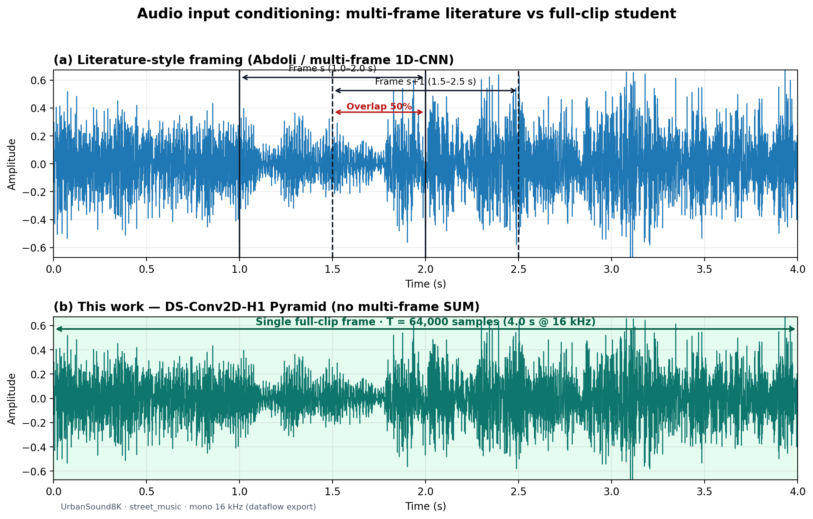
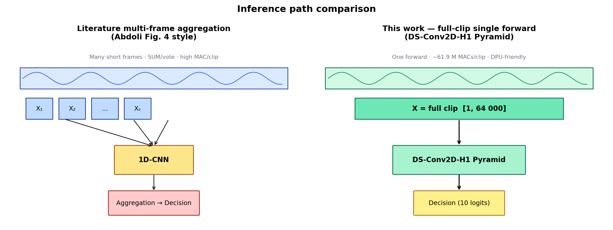
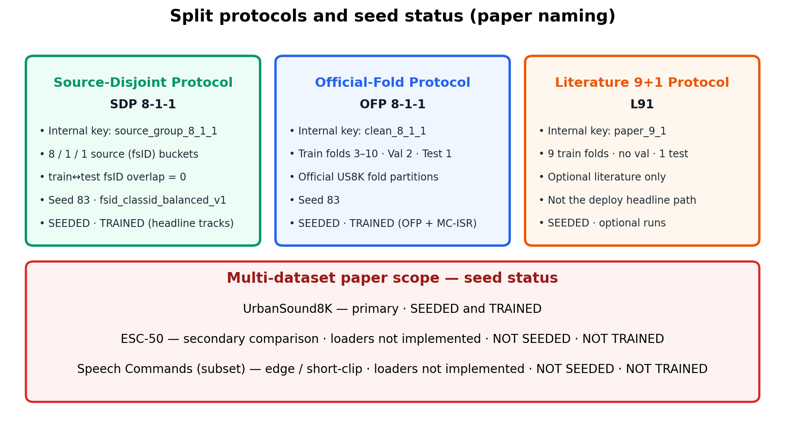
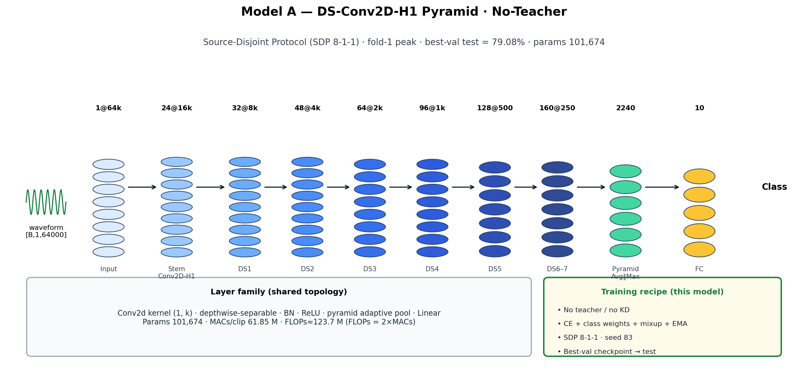
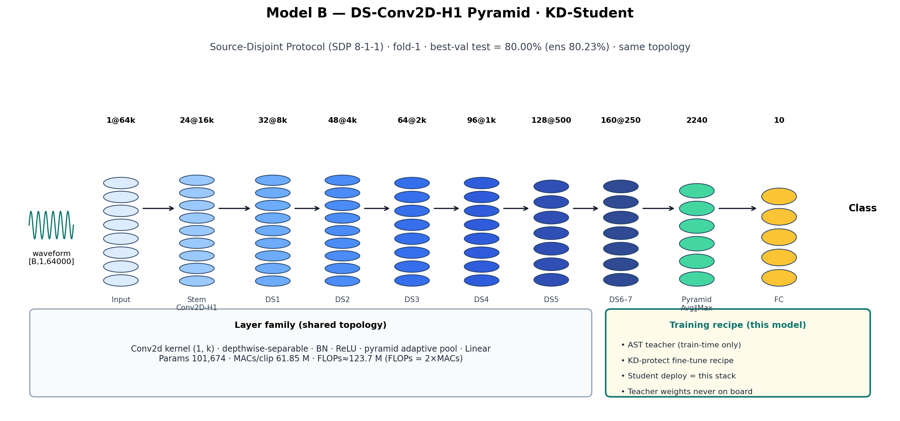
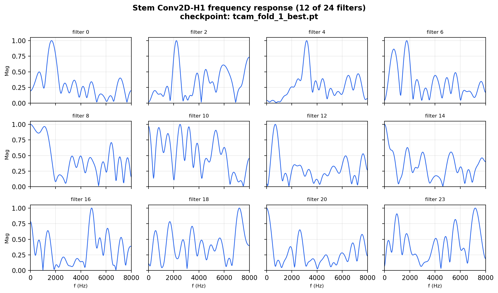
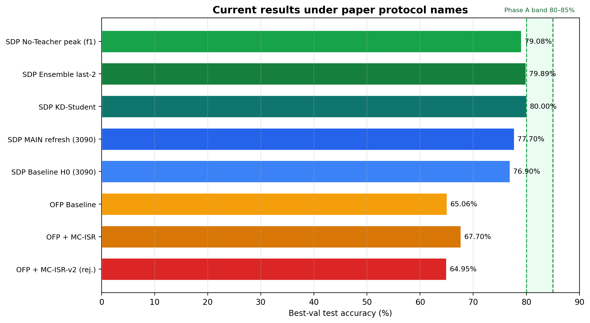

# Source-Safe Environmental Sound Classification with Deployable Full-Clip 1D-CNNs

**Thesis / paper repository** for urban environmental sound classification on [UrbanSound8K](https://urbansounddataset.weebly.com/urbansound8k.html), targeting a **KV260-class** compute budget. The scientific focus is a **full-clip, source-safe** student whose layers remain **depthwise-separable temporal convolutions**, packed as **Conv2D with height = 1** for DPU/Vitis-AI deployment.

| Item | Lock |
|------|------|
| **Primary task** | 10-class ESC on UrbanSound8K |
| **Deployable student** | **DS-Conv2D-H1 Pyramid** |
| **Params / MACs / FLOPs** | **101 674** / **61.85 M MACs·clip⁻¹** / **≈123.7 M FLOPs·clip⁻¹** (FLOPs = 2×MACs) |
| **Training hardware (paper)** | **NVIDIA RTX 3090** |
| **Reproducibility seed** | **83** |
| **Phase A target** | **80–85%** best-val test (single / ensemble / KD student) |
| **Phase B (later)** | SoC → quantization → KV260 |

**Paper naming** of splits and runs: [`docs/paper/NAMING.md`](docs/paper/NAMING.md) · **Bias & checkpoints:** [`docs/paper/BIAS_AND_CHECKPOINTS.md`](docs/paper/BIAS_AND_CHECKPOINTS.md) · **Achieved:** [`docs/main/ACHIEVED.md`](docs/main/ACHIEVED.md)

---

## Table of contents

1. [Data and structure](#1-data-and-structure)
2. [Model architectures (two headline models)](#2-model-architectures)
3. [Results](#3-results)
4. [Next expectations](#4-next-expectations)
5. [Checkpoints, weights, and bias](#5-checkpoints-weights-and-bias)
6. [Repository layout](#6-repository-layout)
7. [Quick start](#7-quick-start)

---

## 1. Data and structure

### 1.1 Corpus

| Property | Value |
|----------|------:|
| Clips | 8 732 |
| Classes | 10 |
| Official folds | 10 |
| Source key | Freesound **fsID** (many clips share one recording) |
| Sample rate (project) | 16 kHz mono |
| Clip duration | 4.0 s → **64 000** samples |
| MAIN framing | **1 frame / clip** (full waveform) |

Official reference: [UrbanSound8K](https://urbansounddataset.weebly.com/urbansound8k.html). Same **fsID** in train and test enables recording-fingerprint leakage; split design is therefore part of the method.

### 1.2 Pipeline and seed protocols

Presentation follows the spirit of end-to-end 1D-CNN papers (e.g. Abdoli et al., *arXiv:1904.08990* — framing with overlap; multi-frame aggregation) and the project dataflow notebook, **adapted** to our full-clip student.

#### (i) Waveform conditioning — multi-frame literature vs full-clip student



| Path | Input unit | Aggregation | Used as MAIN? |
|------|------------|-------------|----------------|
| Literature multi-frame 1D-CNN | Short frames (e.g. 1 s) with **50% overlap** | SUM / vote over frames | No (reference only) |
| **This work** | **One 4 s clip**, \(T=64\,000\) | **Single forward** | **Yes** |

#### (ii) Inference aggregation contrast (Abdoli-style Fig. 4 vs this work)



#### (iii) Protocols — paper names (internal keys in parentheses)



| Paper name | Short | Internal key | Structure | Seed | Status |
|------------|-------|--------------|-----------|-----:|--------|
| **Source-Disjoint Protocol** | **SDP 8-1-1** | `source_group_8_1_1` | 8 / 1 / 1 **source (fsID) buckets**; train↔test fsID overlap = 0 | **83** | **SEEDED · TRAINED** (headline) |
| **Official-Fold Protocol** | **OFP 8-1-1** | `clean_8_1_1` | Train official folds 3–10, val 2, test 1 | 83 | **SEEDED · TRAINED** (method track) |
| **Literature 9+1 Protocol** | **L91** | `paper_9_1` | 9 train folds / no val / 1 test | — | Optional only |

**Named runs (do not use slang in paper text):**

| Avoid in prose | Prefer |
|----------------|--------|
| “clean811 base” | **OFP Baseline** |
| “clean811 MC-ISR” | **OFP + MC-ISR** |
| “source_group MAIN” | **SDP MAIN** / **SDP Baseline** |
| “source_group” alone | **Source-Disjoint Protocol (SDP)** |

Primary metric when validation exists: **`test_acc_best_val_model`**.

#### (iv) Multi-dataset seed status

| Dataset | Role | Seeded | Trained |
|---------|------|--------|---------|
| **UrbanSound8K** | Primary | **yes** | **yes** |
| **ESC-50** | Secondary | **not yet** | **not yet** |
| **Speech Commands** (subset) | Edge / short-clip | **not yet** | **not yet** |

Details: [`docs/paper/DATA.md`](docs/paper/DATA.md), [`docs/paper/NAMING.md`](docs/paper/NAMING.md).

---

## 2. Model architectures

Headline accuracies come from **two training recipes on the same DS-Conv2D-H1 Pyramid topology** (not two unrelated backbones). They are shown **separately** below, in the channel-stack style of classical 1D-CNN papers (Abdoli Fig. 2; verified shapes from torch hooks).

| Model | Recipe | Protocol | Best-val test | Ensemble |
|-------|--------|----------|-------------:|---------:|
| **A. No-Teacher** | CE + class weights + mixup + EMA | SDP 8-1-1 | **79.08%** | **79.89%** |
| **B. KD-Student** | AST teacher → KD-protect fine-tune | SDP 8-1-1 | **80.00%** | **80.23%** |

Shared stack: **101 674** params · **61.85 M** MACs/clip · full-clip input `[B,1,64000]`.

### 2.1 Model A — No-Teacher (79.08%)



**Layer stack (C @ L):**

| Stage | Output shape | Operators |
|-------|--------------|-----------|
| Input | 1 @ 64 000 | mono waveform 4 s @ 16 kHz |
| Stem Conv2D-H1 | 24 @ 16 000 | k=31, s=4, BN, ReLU |
| DS blocks 1–7 | 32@8k → … → 160@250 | depthwise Conv2D-H1 → pointwise 1×1 |
| Pyramid pool | 2 240 | adaptive Avg ∥ Max, bins {1,2,4} |
| Classifier | 10 | Dropout + Linear |

Evidence: `local_multifold_pyramid_base_f1_f3_50ep` / fold_1.

### 2.2 Model B — KD-Student (80.00%)



**Same layer stack as Model A.** Difference is the **training recipe**: an **AST Transformer teacher** (log-mel patches + multi-head attention; train-time only) distills into this student. **Deployed weights are always the student** — teacher never goes to KV260.

Evidence: `local_finetune_kdprotect_f1_20ep` / fold_1.

### 2.3 Stem filter frequency response (interpretability)

Following Abdoli-style filter analysis (paper Fig. 6), magnitude spectra of the **learned stem Conv2D-H1** kernels (from the No-Teacher checkpoint when present):



### 2.4 Complexity (shared student)

| Quantity | Value | Convention / source |
|----------|------:|---------------------|
| Parameters | **101 674** | `sum(p.numel())` / metrics JSON |
| MACs / clip | **61.85 M** | Conv+Linear lower bound |
| FLOPs / clip | **≈123.7 M** | project: **FLOPs = 2 × MACs** |

Methodology: [`docs/paper/MODELS.md`](docs/paper/MODELS.md) §4 · [fvcore](https://github.com/facebookresearch/fvcore/blob/main/fvcore/nn/flop_count.py) · [ptflops](https://github.com/sovrasov/flops-counter.pytorch).

---

## 3. Results



### 3.1 Phase A tracks (SDP 8-1-1, seed 83)

| Track | Target | Best achieved | Status |
|-------|--------|--------------:|--------|
| 1. Single (No-Teacher) | 80–85% | **79.08%** | Below 80%; **fold-1 peak** |
| 2. Ensemble last-2 | 80–85% | **79.89%** | Near 80% on that fold |
| 3. KD-Student | 80–85% | **80.00%** (ens 80.23%) | Hits 80% band |

### 3.2 Comparative table (paper names)

| Run (paper name) | Protocol | best-val test | Role |
|------------------|----------|-------------:|------|
| **SDP No-Teacher peak (f1)** | SDP | **79.08%** | Headline single |
| **SDP Ensemble** | SDP | **79.89%** | Headline ensemble |
| **SDP KD-Student** | SDP | **80.00%** | Headline KD |
| SDP MAIN refresh (3090) | SDP | 77.70% | Working server band |
| SDP Baseline H0 (3090) | SDP | 76.90% | Secondary |
| **OFP Baseline** | OFP | **65.06%** | Strict-fold baseline |
| **OFP + MC-ISR** | OFP | **67.70%** | Best OFP method (+2.6 pp) |
| OFP + MC-ISR-v2 | OFP | 64.95% | **Rejected** |

### 3.3 Variance note

Same SDP MAIN recipe, seed 83: fold-1 peak **79.08%**; folds 1–3 mean **~71.2%**; 3090 band **~76.9–77.7%**. Always state **protocol + fold + selection rule** with every percentage. Full table: [`docs/main/ACHIEVED.md`](docs/main/ACHIEVED.md).

---

## 4. Next expectations

| Horizon | Expectation |
|---------|-------------|
| Near-term Track 1 | Stable **≥80%** SDP single (beyond one fold peak) |
| Near-term Track 3 | KD-Student toward **82–85%** without deploying teacher |
| Method (OFP) | Lift **OFP + MC-ISR** from 67.7% toward **≥75%** (do not re-run rejected v2 axis) |
| Multi-dataset | Seed **ESC-50** + **Speech Commands** (now: not trained) |
| Phase B | Quant + KV260 after Phase A is credible |

---

## 5. Checkpoints, weights, and bias

### What is a **bias**?

In \(y = Wx + b\), **\(b\)** is the bias — an additive offset so a unit need not force every hyperplane through the origin. In **DS-Conv2D-H1 Pyramid**:

- Convolutions use **`bias=False`** (no kernel bias),
- **BatchNorm** still learns shift **β** (stored as `.bn.bias`),
- **Linear** classifier has **`fc.bias`** (10-D).

≈ **1 274** bias parameters out of **101 674** total. This is **not** “statistical bias” of the accuracy estimate — it is a **tensor type** in the network.

Full explanation: [`docs/paper/BIAS_AND_CHECKPOINTS.md`](docs/paper/BIAS_AND_CHECKPOINTS.md).

### Package layout (`.pt` remains mandatory)

| File | Role |
|------|------|
| `*_full.pt` | **Canonical** full `state_dict` (weights + biases) — eval / resume |
| `*_weights.pt` | Kernels / BN-γ / FC-W only |
| `*_biases.pt` | **Bias sidecar** (BN-β + FC bias) for deploy audit / DPU packing notes |
| `*_package_manifest.json` | Per-tensor stats |

Export (local artifacts; `*.pt` is gitignored):

```bash
python tools/export_checkpoint_package.py \
  --checkpoint experiments/local_multifold_pyramid_base_f1_f3_50ep/fold_1/checkpoints/tcam_fold_1_best.pt \
  --out_dir artifacts/checkpoints/sdp_noteacher_f1_79p08 \
  --label sdp_noteacher_f1_79p08

python tools/export_checkpoint_package.py \
  --checkpoint experiments/local_finetune_kdprotect_f1_20ep/fold_1/checkpoints/tcam_fold_1_best.pt \
  --out_dir artifacts/checkpoints/sdp_kd_student_f1_80p00 \
  --label sdp_kd_student_f1_80p00
```

**Rule:** bias export **never replaces** the full `.pt`. Hardware buffers may split weight vs bias; research eval always reloads the full checkpoint.

---

## 6. Repository layout

See [`STRUCTURE.md`](STRUCTURE.md).

```text
README.md / STRUCTURE.md
train.py
configs/main/                 # paper entry configs
src/models/                   # DS-Conv2D-H1, DS-Res1D-SE, AST teacher, …
tools/
  generate_paper_figures_v2.py
  export_checkpoint_package.py
docs/paper/                   # DATA, MODELS, NAMING, BIAS, figures/
docs/main/                    # ACHIEVED, tracks, MC-ISR
artifacts/checkpoints/        # local full.pt + biases.pt packages (gitignored .pt)
```

Regenerate figures:

```bash
python tools/generate_paper_figures_v2.py
```

---

## 7. Quick start

```bash
pip install -r requirements.txt

python tools/run_multifold.py \
  --config configs/main/student_ds_conv2d_h1_pyramid_sourcegroup.json \
  --exp_name my_sdp_f1_50ep \
  --folds 1 \
  --epochs 50 \
  --analyze \
  --eval_modes
```

| Purpose | Config |
|---------|--------|
| SDP MAIN (No-Teacher) | `configs/main/student_ds_conv2d_h1_pyramid_sourcegroup.json` |
| OFP Baseline | `configs/main/student_ds_conv2d_h1_pyramid_clean811.json` |
| OFP + MC-ISR | `configs/main/student_ds_conv2d_h1_pyramid_clean811_mcisr.json` |

---

## References (figure / method context)

- J. Salamon et al., UrbanSound8K, ACM MM 2014.  
- S. Abdoli, P. Cardinal, A. L. Koerich, *End-to-End Environmental Sound Classification using a 1D CNN*, arXiv:1904.08990 (framing, architecture stacks, filter analysis, frame aggregation).  
- H. Xu et al., TCAM 1D-CNN, ESWA 2024 (attention 1D-CNN literature baseline).  
- Y. Gong et al., AST, Interspeech 2021 (KD teacher family).  
- S. Ioffe & C. Szegedy, Batch Normalization, ICML 2015 (BN affine β as bias).

---

## License / artifacts

Large `.pt` files are gitignored. Prefer light metrics + documented exp names. Paper hardware wording: **RTX 3090**.
