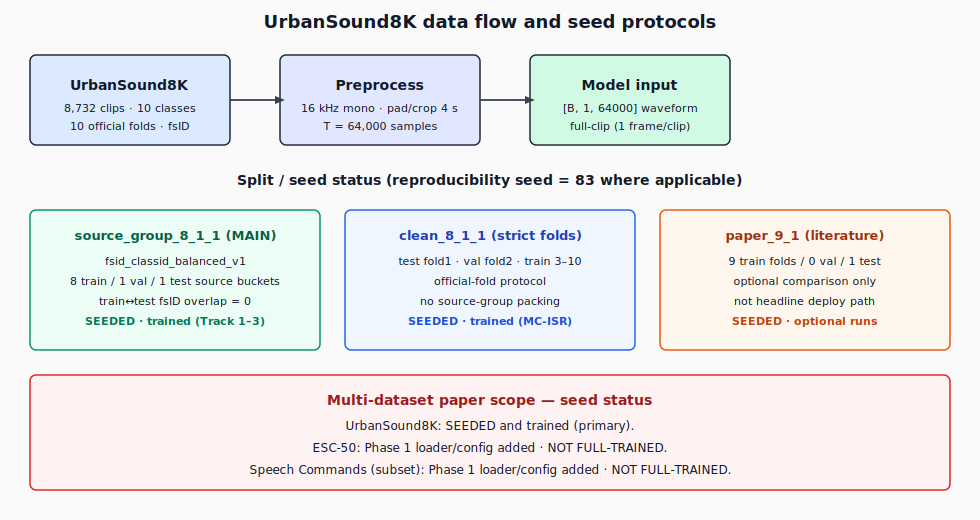
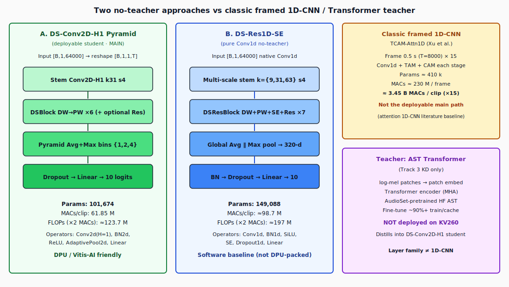
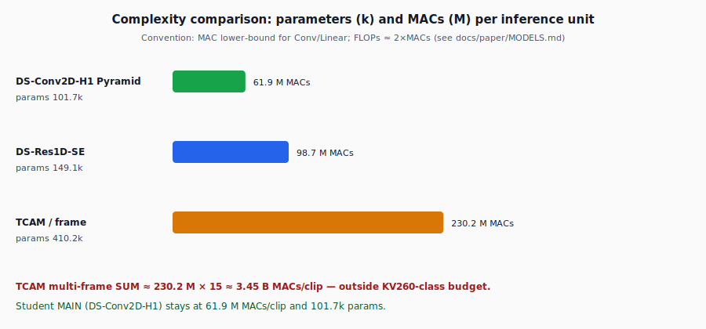
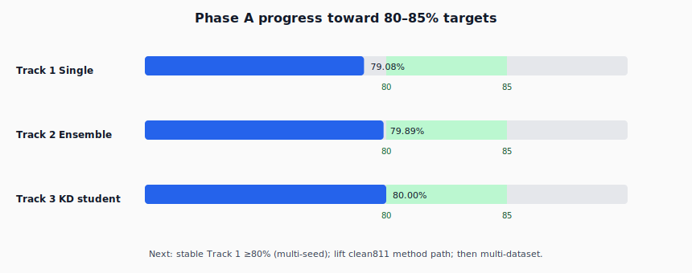
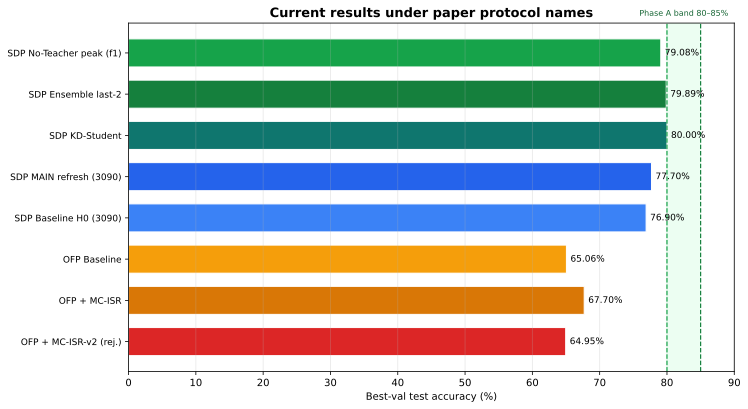

# Source-Safe Environmental Sound Classification with Deployable Full-Clip 1D-CNNs

**Thesis / paper repository** for urban environmental sound classification on [UrbanSound8K](https://urbansounddataset.weebly.com/urbansound8k.html), targeting a **KV260-class** compute budget. The scientific focus is a **full-clip, source-safe** student network whose layers remain **depthwise-separable temporal convolutions**, packed as **Conv2D with height = 1** for DPU/Vitis-AI deployment—contrasted with multi-frame attention 1D-CNNs and a spectrogram Transformer teacher used only for distillation.

| Item | Lock |
|------|------|
| **Primary task** | 10-class ESC on UrbanSound8K |
| **Deployable student** | **DS-Conv2D-H1 Pyramid** (`ds_conv2d_h1_pyramid`) |
| **Params / MACs / FLOPs** | **101 674** / **61.85 M MACs·clip⁻¹** / **≈123.7 M FLOPs·clip⁻¹** (FLOPs = 2×MACs) |
| **Training hardware (paper)** | **NVIDIA RTX 3090** |
| **Reproducibility seed** | **83** (where protocol uses a seed) |
| **Phase A target** | **80–85%** best-val test (single / ensemble / KD student) |
| **Phase B (later)** | SoC design → quantization → KV260 board |

Detailed cards: [`docs/paper/DATA.md`](docs/paper/DATA.md) · [`docs/paper/MODELS.md`](docs/paper/MODELS.md) · [`docs/main/ACHIEVED.md`](docs/main/ACHIEVED.md) · [`STRUCTURE.md`](STRUCTURE.md)

---

## Table of contents

1. [Data and structure](#1-data-and-structure)
2. [Model architectures (two no-teacher approaches + teacher)](#2-model-architectures)
3. [Results](#3-results)
4. [Next expectations](#4-next-expectations)
5. [Repository layout](#5-repository-layout)
6. [Quick start](#6-quick-start)

---

## 1. Data and structure

### 1.1 Corpus

UrbanSound8K comprises **8 732** labeled clips across **10** classes, organized into **10 official folds**, with metadata including Freesound **`fsID`**. Many clips share a recording source; **train–test source overlap** can inflate accuracy if ignored. This project therefore treats **split design as part of the method**, not a preprocessing detail.

| Property | Value |
|----------|------:|
| Clips | 8 732 |
| Classes | 10 |
| Official folds | 10 |
| Project sample rate | 16 kHz mono |
| Clip duration | 4.0 s → **64 000** samples |
| MAIN framing | **1 frame / clip** (full waveform) |

### 1.2 Pipeline and seed protocols



**Preprocess (MAIN waveform models):**

```text
WAV → mono @ 16 kHz → pad/crop 4 s → tensor [B, 1, 64000]
```

**Protocols used in this repository:**

| Protocol | Train / Val / Test | Seed | Status |
|----------|-------------------|-----:|--------|
| **`source_group_8_1_1`** + `fsid_classid_balanced_v1` | 8 / 1 / 1 **source buckets**; train↔test **fsID overlap = 0** | **83** | **SEEDED · TRAINED** (Tracks 1–3) |
| **`clean_8_1_1`** | official folds: train 3–10, val 2, test 1 | 83 | **SEEDED · TRAINED** (baseline + MC-ISR) |
| **`paper_9_1`** | 9 train folds / no val / 1 test | — | Optional literature only |

Primary metric when validation exists: **`test_acc_best_val_model`** (test accuracy of the best validation checkpoint). Secondary: last snapshot, last-2 ensemble.

### 1.3 Multi-dataset paper scope (seed status)

| Dataset | Role | Loader | Seeded | Trained |
|---------|------|--------|--------|---------|
| **UrbanSound8K** | Primary | yes | **yes** | **yes** |
| **ESC-50** | Secondary environmental comparison | **not implemented** | **not yet** | **not yet** |
| **Speech Commands** (subset) | Short-clip / edge narrative | **not implemented** | **not yet** | **not yet** |

> **Note for the paper draft:** only UrbanSound8K currently has seedable splits and trained metrics in this repo. ESC-50 and Speech Commands are planned extensions; do not claim numbers until loaders and runs land under `docs/experiments/REGISTRY.md`.

Further data documentation: [`docs/paper/DATA.md`](docs/paper/DATA.md), [`docs/data/`](docs/data/).

---

## 2. Model architectures

Model **files and class names reflect layer families** (not product codenames). Legacy identifiers remain as aliases so historical configs and metrics stay valid.

| Paper name | Class | Registry key | Role |
|------------|-------|--------------|------|
| **DS-Conv2D-H1 Pyramid** | `DSConv2DH1PyramidNet` | `ds_conv2d_h1_pyramid` | **MAIN deployable student** (no-teacher + KD student) |
| **DS-Res1D-SE** | `DSRes1DSENet` | `ds_res1d_se` | Pure-Conv1d **no-teacher** baseline |
| **AST Transformer Teacher** | `ASTTransformerTeacher` | HF AST | **Teacher only** (Track 3) |
| TCAM-Attn1D | `TCAMAttn1DNet` | `tcam_attn1d` | Literature multi-frame baseline |



### 2.1 Approach A — DS-Conv2D-H1 Pyramid (MAIN)

Logical **1D temporal CNN** on raw audio, implemented as **Conv2D with kernel height = 1**:

```text
[B,1,T] → [B,1,1,T]
  → Stem Conv2D-H1 (k=31, s=4)
  → Depthwise-separable blocks (DW Conv2D-H1 → PW 1×1) × 6+
  → Pyramid adaptive Avg∥Max over temporal bins {1,2,4}
  → Dropout → Linear → 10 logits
```

**Why this differs from a “generic 1D-CNN” story**

| Aspect | Framed multi-frame 1D-CNN (e.g. TCAM) | DS-Conv2D-H1 Pyramid |
|--------|--------------------------------------|----------------------|
| Input unit | Short frames (e.g. 0.5 s) × many hops | **One full 4 s clip** |
| Aggregation | SUM / vote over frames | **Single forward** |
| Core ops | Conv1d + time/channel attention | **DS Conv2d(H=1)** + pyramid pool |
| MAC / clip | ~3.45 B (230 M × 15 frames) | **~61.9 M** |
| Deploy | Attention + frame loop heavy | **DPU-friendly operator set** |

### 2.2 Approach B — DS-Res1D-SE (no-teacher software baseline)

Native **Conv1d** multi-scale stem and **depthwise-separable residual** blocks with **Squeeze-and-Excitation** (SiLU). Same full-clip I/O; useful as a software baseline that does **not** pack kernels as Conv2D-H1.

```text
[B,1,64000]
  → Multi-scale stem k∈{9,31,63}, s=4
  → DSResBlock (DW→PW→SE→residual) × 7
  → Global Avg ∥ Max → Linear → 10
```

### 2.3 Teacher — AST Transformer (distillation only)

[Audio Spectrogram Transformer](https://github.com/YuanGongND/ast) (HuggingFace `MIT/ast-finetuned-audioset-10-10-0.4593`): **log-mel patches → Transformer encoder**. Fine-tuned on source-safe splits (~90%+ train/cache in internal runs). **Never deployed**; logits distill into the DS-Conv2D-H1 student (Track 3). Wrapper: `src/models/ast_transformer_teacher.py`.

### 2.4 Parameters, MACs, and FLOPs



| Model | Params | MACs / unit | FLOPs (2×MAC) | Unit |
|-------|------:|------------:|--------------:|------|
| **DS-Conv2D-H1 Pyramid** (MAIN) | **101 674** | **61.85 M** | **≈123.7 M** | per **clip** |
| DS-Res1D-SE | 149 088 | ≈98.7 M | ≈197 M | per clip |
| TCAM-Attn1D | ≈410 k | ≈230.2 M | ≈460 M | per **frame** |
| TCAM ×15 frames | ≈410 k | ≈3.45 B | ≈6.9 B | per clip |

**Definitions (do not mix):**

1. **Parameters** — count of learned tensors; independent of sequence length.  
2. **MACs** — multiply-accumulate ops for one forward; shape-dependent.  
3. **FLOPs** — floating-point ops; **convention-dependent**.

**Analytic Conv lower bound** (also used in-repo):

```text
MACs = L_out · C_out · (C_in / groups) · K
Linear MACs = F_in · F_out
```

Excludes activations, residual adds, SE multiplies, and pooling arithmetic → **conservative lower bound**.

**External methodology sources**

| Reference | Relevance |
|-----------|-----------|
| [fvcore `flop_count`](https://github.com/facebookresearch/fvcore/blob/main/fvcore/nn/flop_count.py) | FLOP definitions are tool-dependent; common fused MAC counting |
| [ptflops](https://github.com/sovrasov/flops-counter.pytorch) | Theoretical MAC + parameter reporting |
| [TensorFlow profiler `float_operation`](https://www.tensorflow.org/api_docs/python/tf/compat/v1/profiler/ProfileOptionBuilder) | Op-registration dependent FLOP stats |
| This repo | [`docs/architecture/Architecture_FLOPs_Analysis.md`](docs/architecture/Architecture_FLOPs_Analysis.md), [`docs/paper/MODELS.md`](docs/paper/MODELS.md) §4, `tools/flops_lower_bound_check.py` |

Project config convention for deployment tables:

```text
FLOPs = 2 × MACs
```

If a table adopts the fvcore “1 MAC = 1 FLOP” style, report **61.85 M FLOPs/clip** for the MAIN student and state that convention explicitly.

---

## 3. Results

All headline numbers are **research truth** (machine only affects where files live). Full table: [`docs/main/ACHIEVED.md`](docs/main/ACHIEVED.md).

### 3.1 Phase A — three accuracy tracks (`source_group_8_1_1`, seed 83)



| Track | Target | Best achieved | Evidence exp | Status |
|-------|--------|--------------:|--------------|--------|
| **1. Single model** | 80–85% | **79.08%** best-val test | `local_multifold_pyramid_base_f1_f3_50ep` / fold_1 | Below 80%; fold-1 peak |
| **2. Ensemble (last-2)** | 80–85% | **79.89%** | same | Near 80% on that fold |
| **3. KD student** | 80–85% student | **80.00%** (ens **80.23%**) | `local_finetune_kdprotect_f1_20ep` / fold_1 | Hits 80% band |

Teacher (not deploy accuracy): AST fine-tune/cache **~90%+**.

### 3.2 Comparative bar chart



| Run | Protocol | best-val test | Ensemble | Role |
|-----|----------|-------------:|---------:|------|
| Fold-1 peak single | source_group | **79.08%** | **79.89%** | Research high-water (fold 1) |
| KD student | source_group | **80.00%** | **80.23%** | Track 3 |
| 3090 MAIN refresh | source_group | 77.70% | 78.51% | Working server band |
| 3090 H0 baseline | source_group | 76.90% | 75.40% | Secondary |
| clean811 base | clean_8_1_1 | **65.06%** | 66.44% | Strict-fold baseline |
| clean811 **MC-ISR v1** | clean_8_1_1 | **67.70%** | 66.44% | Best clean811 method (+2.6 pp) |
| clean811 MC-ISR v2 | clean_8_1_1 | 64.95% | 64.72% | **Rejected** (worse than v1) |

### 3.3 Variance note (required for honest claims)

Same MAIN-family config, seed 83, no-teacher:

| Evidence | best-val test |
|----------|-------------:|
| Fold 1 peak files | **79.08%** (duplicated path evidence, not two seeds) |
| Same multifold fold 2 / 3 | 67.67% / 66.93% |
| Folds 1–3 mean | **~71.2%** (std ~5.6) |
| 3090 MAIN 50ep band | **~76.9–77.7%** |

**Interpretation:** 79.08% / 79.89% are **fold-1 high-water marks**, not multi-fold or multi-seed means. Paper text must state **protocol, fold, and selection rule** next to every percentage.

### 3.4 Shared stack for MAIN claims

| Item | Value |
|------|--------|
| Model | DS-Conv2D-H1 Pyramid full-clip |
| Config (no-teacher) | `configs/main/student_ds_conv2d_h1_pyramid_sourcegroup.json` (alias of historical `kv260_ds1d_pyramid_mixup_ema_val.json`) |
| Checkpoint rule | best validation → report that checkpoint’s test |
| Loss stack (MAIN) | CE + class weights + mixup + EMA |
| Method track (clean811) | MC-ISR v1 — see [`docs/main/ALGORITHM_MCISR.md`](docs/main/ALGORITHM_MCISR.md) |

---

## 4. Next expectations


| Horizon | Expectation | Rationale |
|---------|-------------|-----------|
| **Near-term (Track 1)** | Stable single-model **≥80%** on source-group (beyond one fold peak) | Gap ≈0.9 pp from peak; need multi-seed / multi-fold credibility, not only fold-1 max |
| **Near-term (Track 2)** | Ensemble **≥80%** with the same stability bar | Already 79.89% peak; should follow Track 1 gains |
| **Near-term (Track 3)** | KD student toward **82–85%** without teacher deploy | Already 80.0%; headroom via better teacher cache / protect recipes |
| **Method (clean811)** | Lift MC-ISR path from **67.7%** toward **≥75%** before claiming protocol-robust SOTA | v2 rejected; do not re-strengthen the same jack–drill axis |
| **Multi-dataset** | Implement **ESC-50** + **Speech Commands** loaders; first seeded baselines | Marked **not trained** until done |
| **Phase B** | Quantization + KV260 deployment **after** Phase A is credible | Accuracy-first lock remains |

**Not claimed yet:** single **85%**, multi-fold mean 80–85%, ESC-50/Speech Commands numbers, on-board FPS/power.

Roadmap pointers: [`docs/main/THREE_ACCURACY_TRACKS.md`](docs/main/THREE_ACCURACY_TRACKS.md), [`docs/main/ACTIVE_ROADMAP.md`](docs/main/ACTIVE_ROADMAP.md).

---

## 5. Repository layout

Designed for **paper writing + easy inheritance** (new models, datasets, experiments without parallel trees). Full guide: [`STRUCTURE.md`](STRUCTURE.md).

```text
README.md / STRUCTURE.md
train.py                      # training entry
configs/main/                 # canonical paper configs
configs/                      # historical ablations + INDEX.md
src/models/                   # layer-named nets (+ legacy shims)
src/data|training|utils/
tools/                        # multifold, analyze, figure generation
docs/paper/                   # DATA, MODELS, figures (SVG)
docs/main/                    # ACHIEVED, tracks, MC-ISR, decisions
docs/data|architecture|experiments|…
results/figures/              # shareable charts
experiments/                  # runtime (large .pt gitignored)
```

**Model rename map (layer nature):**

| Legacy | Paper name |
|--------|------------|
| `KV260AudioNetDS1D` / `kv260_audio_net_ds1d` | **DS-Conv2D-H1 Pyramid** / `ds_conv2d_h1_pyramid` |
| `EfficientAudioCNN1D` / `efficient_audio_cnn1d` | **DS-Res1D-SE** / `ds_res1d_se` |
| HF AST tools | **AST Transformer Teacher** / `ASTTransformerTeacher` |
| `TCAM1DCNN` / `tcam1dcnn` | **TCAM-Attn1D** / `tcam_attn1d` |

---

## 6. Quick start

```bash
pip install -r requirements.txt
# Place UrbanSound8K at data/UrbanSound8K (see docs/paper/DATA.md)

python tools/run_multifold.py \
  --config configs/main/student_ds_conv2d_h1_pyramid_sourcegroup.json \
  --exp_name my_run_f1_50ep \
  --folds 1 \
  --epochs 50 \
  --analyze \
  --eval_modes
```

Regenerate paper figures after updating ACHIEVED numbers:

```bash
python tools/generate_paper_figures.py
```

### Canonical config shortcuts

| Purpose | Path |
|---------|------|
| MAIN source-group student | `configs/main/student_ds_conv2d_h1_pyramid_sourcegroup.json` |
| clean811 baseline | `configs/main/student_ds_conv2d_h1_pyramid_clean811.json` |
| clean811 MC-ISR v1 | `configs/main/student_ds_conv2d_h1_pyramid_clean811_mcisr.json` |
| DS-Res1D-SE baseline | `configs/main/student_ds_res1d_se_fullclip.json` |

---

## Citation-oriented references (method context)

- J. Salamon, C. Jacoby, J. P. Bello, *A Dataset and Taxonomy for Urban Sound Research*, ACM MM 2014 (UrbanSound8K).  
- H. Xu et al., *A Lightweight Channel and Time Attention Enhanced 1D CNN Model for Environmental Sound Classification*, ESWA 2024 (TCAM literature baseline).  
- Y. Gong, Y.-A. Chung, J. Glass, *AST: Audio Spectrogram Transformer*, Interspeech 2021 (teacher family).  
- Complexity tooling: fvcore FLOP counter; ptflops; this repo’s MAC lower-bound analysis.

---

## License / artifacts

Runtime checkpoints and large experiment blobs are **not** the primary git payload. Prefer light metrics under `results/` and documented exp names in [`docs/experiments/REGISTRY.md`](docs/experiments/REGISTRY.md). Paper hardware wording: **RTX 3090** for main training results.
